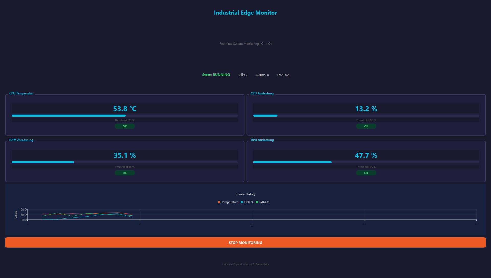

# Edge Monitor — Qt Dashboard

Real-time system monitoring dashboard built with modern C++ and Qt 6. Reads CPU temperature, CPU usage, RAM and disk metrics with live charts and CSV data logging.

Cross-platform: reads real hardware sensors on Linux, simulates values on Windows.

## Features

- 4 sensor cards with real-time values and alarm indicators
- Live scrolling chart (temperature, CPU, RAM history)
- CSV data logging with timestamps (monitor_log.csv)
- Start/Stop monitoring control
- Color-coded alarm system (blue = OK, red = ALARM)
- Dark mode professional UI
- Cross-platform (Linux: real sensors, Windows: simulated)

## Screenshot



## Tech Stack

- **Language**: C++17
- **Framework**: Qt 6 (Widgets, Charts)
- **Build**: CMake
- **CI/CD**: GitHub Actions
- **Platform**: Linux / Windows

## How it works

```text
                     System Hardware
                        (TI AM67A)
                            |
                            v

+--------------------+       +--------------------+
| Sensor Readers     | ----> | Sensor Widgets     |
|--------------------|       | (Qt UI Cards)      |
| /proc/stat         |       +--------------------+
| /proc/meminfo      |
| /sys/thermal       |       +--------------------+
| statvfs            | ----> | Live Chart         |
+--------------------+       | (QChart)           |
                             +--------------------+

           |
           v

+--------------------+       +--------------------+
| GPIO Monitor       | ----> | GPIO Status        |
|--------------------|       | HIGH / LOW         |
| libgpiod v2        |       +--------------------+
| gpioget -c x y     |
+--------------------+

           |
           v

+--------------------+       +--------------------+
| LED Controller     |       | CSV Logger         |
|--------------------|       | monitor_log.csv    |
| ACT = OK (Green)   |       +--------------------+
| PWR = ALARM (Red)  |
+--------------------+
```

On Linux: reads real values from /proc and /sys
On Windows: generates realistic simulated values

## Sensor Thresholds

| Sensor | Source | Threshold |
|--------|--------|-----------|
| CPU Temperature | /sys/class/thermal | > 70°C |
| CPU Usage | /proc/stat | > 80% |
| RAM Usage | /proc/meminfo | > 85% |
| Disk Usage | statvfs("/") | > 90% |

## GPIO Mapping (BeagleY-AI)

| Display | Chip | Line | Header Pin |
|---------|------|------|------------|
| GPIO8 | gpiochip1 | 0 | P8 |
| GPIO7 | gpiochip1 | 9 | P7 |
| GPIO22 | gpiochip2 | 41 | P22 |
| GPIO17 | gpiochip3 | 8 | P17 |

## LED Control

| State | ACT LED | PWR LED |
|-------|---------|---------|
| OK | ON (green) | OFF |
| ALARM | OFF | ON (red) |

## Tech Stack

- **Language**: C++17
- **Framework**: Qt 6 (Widgets, Charts)
- **GPIO**: libgpiod v2 (gpioget/gpioset)
- **Build**: CMake
- **CI/CD**: GitHub Actions
- **Platform**: Linux (BeagleY-AI) / Windows (simulated)

## Build

### On BeagleY-AI (Linux ARM64)
```bash
sudo apt install qt6-base-dev qt6-charts-dev cmake g++
git clone https://github.com/meka23749/edge-monitor-qt.git
cd edge-monitor-qt
cmake -B build -S .
cmake --build build
./build/EdgeMonitorQt
```

### Build on Windows

1. Install Qt 6 with Qt Creator
2. Open CMakeLists.txt in Qt Creator
3. Build and Run (Ctrl+R)

## CSV Log Format

The application logs all sensor readings to `monitor_log.csv`:

```csv
timestamp,cpu_temp,cpu_usage,ram_usage,disk_usage,state
2026-07-27 14:30:00,54.6,12.3,45.2,67.8,OK
2026-07-27 14:30:02,68.2,78.5,44.1,67.8,OK
2026-07-27 14:30:04,72.1,82.3,46.7,67.9,ALARM
```

## Related Projects

- [Industrial Protocol Bridge (Yocto ARM64)](https://github.com/meka23749/yocto-industrial-bridge) — Modbus TCP to MQTT bridge on custom Yocto Linux
- [BeagleY-AI Edge Monitor](https://github.com/meka23749/beagley-edge-monitor) — Real hardware monitoring on BeagleY-AI

## Author

**Steve Meka** — Software Engineer

- Website: [stevkmef.com](https://www.stevkmef.com)
- GitHub: [meka23749](https://github.com/meka23749)
